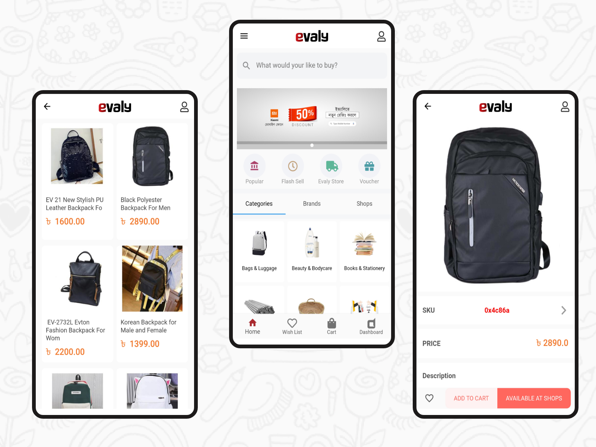
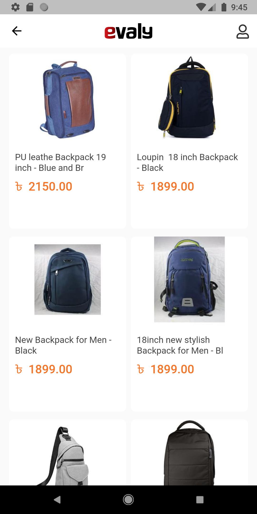
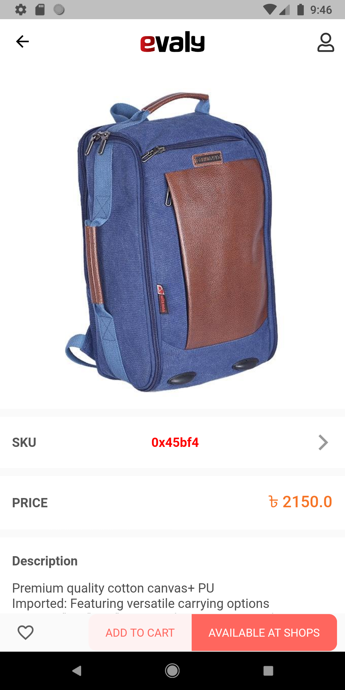

# Flutter ecommerce App 

A small attempt to make an e-commerce user interface in Flutter for Android and iOS. I developed this application just for learning purpose. I am beginner in flutter so if you found any error solve it. I got all API from online by inspecting the orginal website.
## 🤓 Author(s)
**Md Tarikul Islam** 

### App design screen

## ScreenShots 
### Home Page & Category Screen
&nbsp;&nbsp;&nbsp;&nbsp;&nbsp;&nbsp;&nbsp;&nbsp;

### Products Screen & Product Detail Screen
&nbsp;&nbsp;&nbsp;&nbsp;&nbsp;&nbsp;&nbsp;&nbsp;

### Login & Registration Screen
&nbsp;&nbsp;&nbsp;&nbsp;
### Wish list and Empty cart screen
&nbsp;&nbsp;&nbsp;&nbsp;

## ✨ Requirements
* Any Operating System (ie. MacOS X, Linux, Windows)
* Any IDE with Flutter SDK installed (ie.  Android Studio, VSCode, IntelliJ, etc)
* A little knowledge of Dart and Flutter
* A brain to think 🤓🤓
